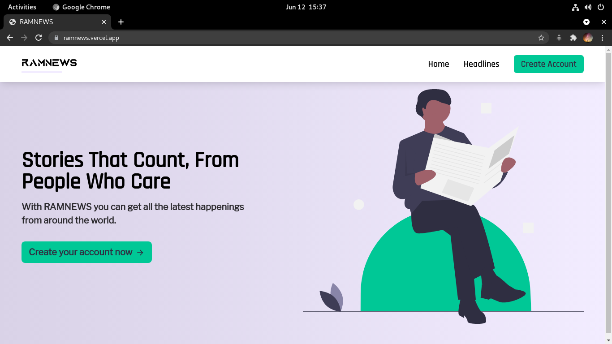
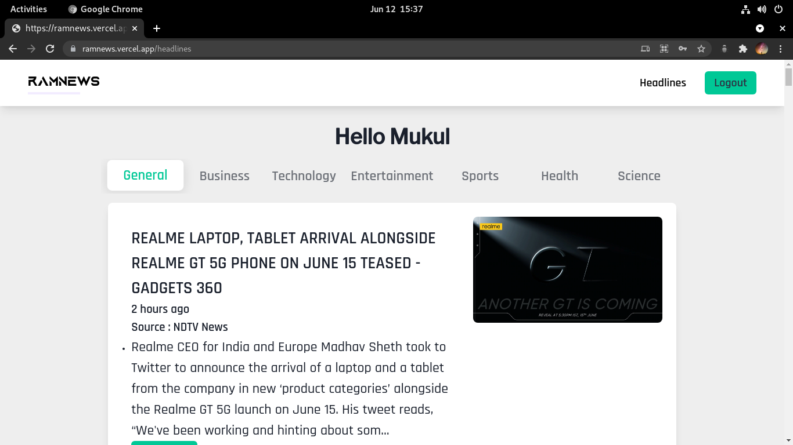
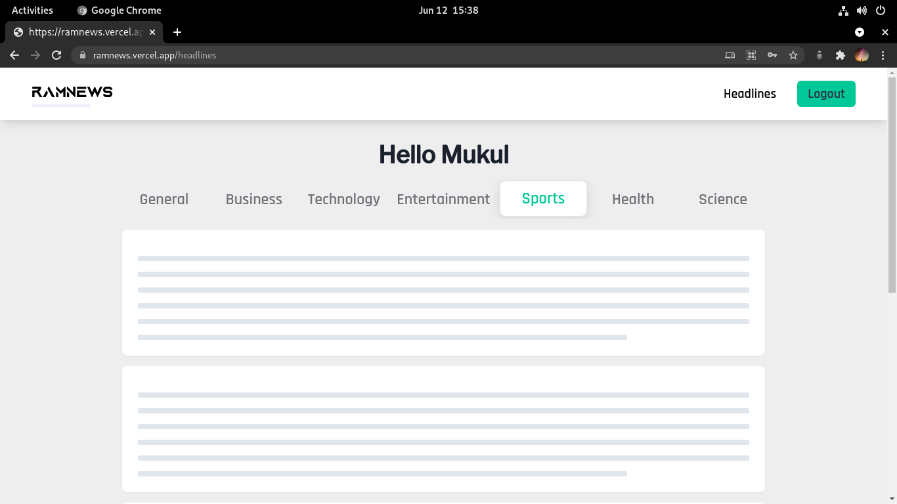

# RAMNEWs

RAM is just a short form for Rohit, Ajith, Mukul as we were not able to come up with any name or you can read it as RAM(Random Access Memory).  
This is a simple web application to list out news articles by their categories(think google news).

We are using [Next.js](https://nextjs.org) to build our front-end and a simple flask backend to service it.

We are using [newsapi](https://newsapi.org/) to fetch news articles and have setup an additional cache layer using [redis](https://redis.io/) to reduce network calls and also to prevent running out of daily quota that newsapi have setup.

## Running the project locally

### For backend

Install all the dependencies into a new virtual environment

```bash
cd api

#Create a new virtual environment
python3 -m venv venv

#Activate the virtual environment
. venv/bin/activate

#Install the dependencies
pip install -r requirements.txt
```

Fill up all the required variables in .env.example  
We have chosen mongodb as the database and redis to maintain cache, provide the credentials in .env.example to connect to your instances of mongodb and redis and rename .env.example to .env

Go the [newsapi](https://newsapi.org/) to generate your api key and add it in .env file.

Add your secrets that will be used to generate JSON Web tokens for the users.

Once the setup is done you can start the backend by giving the command (while still in the virtual environment)
```bash
flask run
```

### For frontend

Stay at the root of the project and run the following command to install all the dependencies.
```bash
yarn
```

One the dependencies are installed you can run
```bash
yarn dev
```
The frontend should be running now and you should be able to access the website on your browser at [http://localhost:3000/](http://localhost:3000).


## Hosted Live For Demo
The frontend of this website is hosted on vercel.
Check it out at [https://ramnews.vercel.app](https://ramnews.vercel.app).

The backend of this website is hosted on an EC2 instance which can be accessed at https://mukulpathania.games:5000/.  
(The backend may not be accessible after sometime if shutdown once my credits are finished or due to any other reason)

## Some Screenshots







